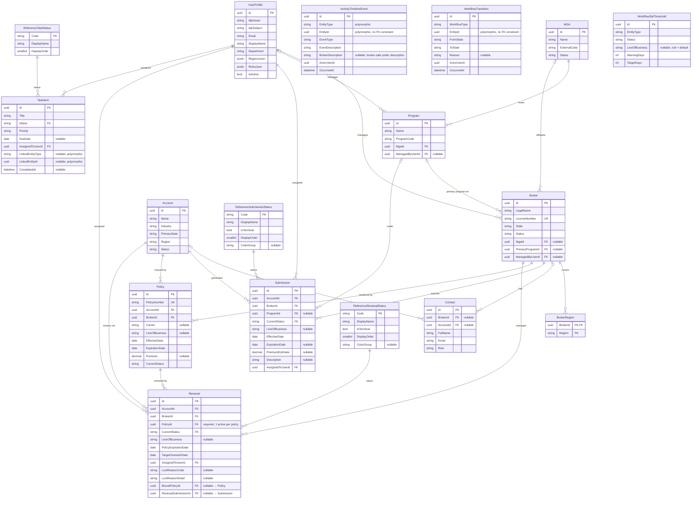
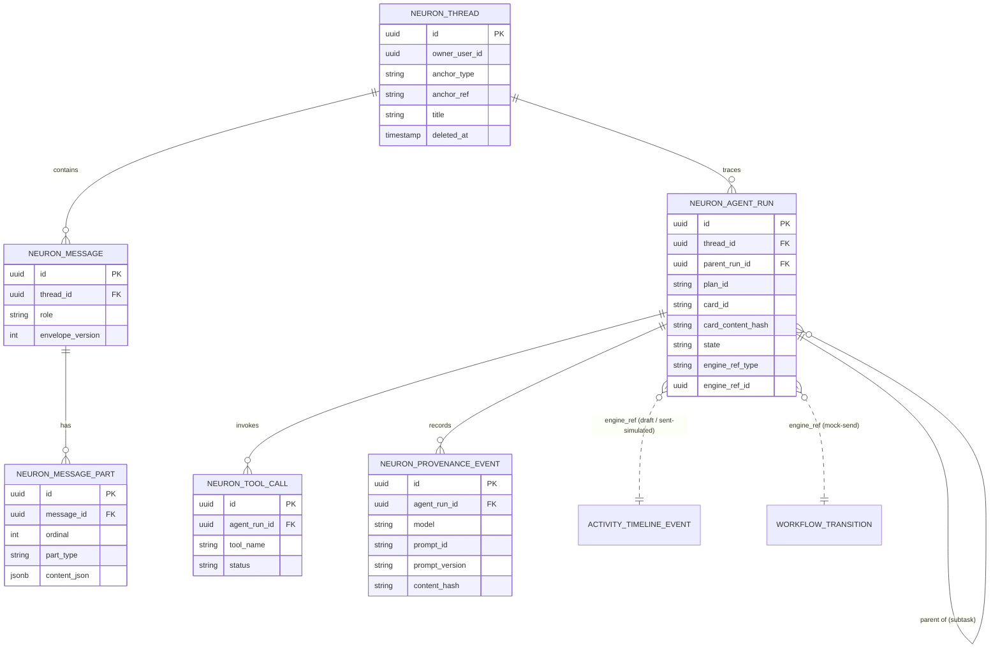

# Nebula CRM — Data Model

**Purpose:** Authoritative data model reference for Nebula CRM. Contains the domain ERD, entity specifications, reference data, query patterns, and migration strategy. Supplements BLUEPRINT.md Section 4.2.

**Last Updated:** 2026-05-06

---

## 0. Domain Entity Relationship Diagram

Reflects all entities through F0007 (Renewal Pipeline) and F0006 (Submission Intake Workflow). Audit fields (`CreatedAt`, `CreatedByUserId`, `UpdatedAt`, `UpdatedByUserId`, `DeletedAt`, `DeletedByUserId`, `IsDeleted`, `RowVersion`) are present on all `BaseEntity` subclasses and omitted from the diagram for clarity.

### Mermaid ERD



### ASCII Companion

For terminals, PR review comments, and ADR inline use.

```
NEBULA CRM — DOMAIN MODEL (as of F0007)
Audit fields omitted (all BaseEntity subclasses carry: Id, CreatedAt/By, UpdatedAt/By, DeletedAt/By, IsDeleted, RowVersion).

IDENTITY
  UserProfile(Id PK, IdpIssuer, IdpSubject UK, Email, DisplayName, Department, Roles[], Regions[])
     │
     │ manages (opt)           manages (opt)           assigned (req)
     ▼                         ▼                        ▼
  Program ◄──────── MGA        Program                 Submission / Renewal / TaskItem

DISTRIBUTION NETWORK
  MGA(Name, ExternalCode, Status)
   ├─hosts──────────────► Program(Name, ProgramCode, MgaId FK, ManagedByUserId FK opt)
   └─affiliates (opt)──► Broker(LegalName, LicenseNumber UK, State, Status,
                                MgaId FK opt, PrimaryProgramId FK opt, ManagedByUserId FK opt)
                           ├─covers──► BrokerRegion(BrokerId PK+FK, Region PK)
                           └─has────► Contact(FullName, Email, Role, BrokerId FK opt, AccountId FK opt)
  Account(Name, Industry, PrimaryState, Region, Status)
   └─has────────────────► Contact (same Contact table, AccountId FK opt)

POLICY (F0018 stub — minimum fields required for F0007 renewal linkage)
  Policy(PolicyNumber UK, Carrier opt, LineOfBusiness opt, EffectiveDate, ExpirationDate, Premium opt, CurrentStatus)
   ├─FK (req)──► Account
   └─FK (req)──► Broker

WORK ITEMS
  Submission(EffectiveDate, ExpirationDate opt, PremiumEstimate opt, Description opt,
            CurrentStatus FK, LineOfBusiness opt)
   ├─FK (req)──► Account
   ├─FK (req)──► Broker
   ├─FK (opt)──► Program
   ├─FK────────► ReferenceSubmissionStatus(Code PK, IsTerminal, DisplayOrder)
   └─FK────────► UserProfile (AssignedToUserId)

  Renewal(PolicyExpirationDate, TargetOutreachDate, CurrentStatus FK, LineOfBusiness opt)
   ├─FK (req)──► Policy               ← 1 active renewal per policy (filtered unique)
   ├─FK (req)──► Account
   ├─FK (req)──► Broker
   ├─FK (opt)──► Policy (BoundPolicyId)    ← set on Completed
   ├─FK (opt)──► Submission (RenewalSubmissionId) ← set on Completed
   ├─FK────────► ReferenceRenewalStatus(Code PK, IsTerminal, DisplayOrder)
   ├─FK────────► UserProfile (AssignedToUserId)
   ├─LostReasonCode (opt)  ← required when Lost
   └─LostReasonDetail (opt) ← required when LostReasonCode = Other

TASKS
  TaskItem(Title, Priority, DueDate opt, Status FK, CompletedAt opt)
   ├─FK────────► UserProfile (AssignedToUserId)
   ├─FK────────► ReferenceTaskStatus(Code PK, DisplayOrder)
   └─polymorphic (no FK)──► Broker | Account | Submission | Renewal
                             via (LinkedEntityType, LinkedEntityId)

CONFIGURATION
  WorkflowSlaThreshold(EntityType, Status, LineOfBusiness opt, WarningDays, TargetDays)
   └─UNIQUE (EntityType, Status, LineOfBusiness) — null LineOfBusiness = default

AUDIT / APPEND-ONLY (no soft delete; polymorphic EntityId — no FK constraint)
  ActivityTimelineEvent(EntityType, EntityId, EventType, EventDescription, BrokerDescription opt, ActorUserId, OccurredAt)
    BrokerDescription: varchar(500) NULL. Populated at event creation for BrokerUser-visible event types
    (BrokerCreated, BrokerUpdated, BrokerStatusChanged, ContactAdded, ContactUpdated) using safe
    predefined templates. NULL for all InternalOnly event types. See F0009 BROKER-VISIBILITY-MATRIX.md.
  WorkflowTransition   (WorkflowType, EntityId, FromState, ToState, Reason opt, ActorUserId, OccurredAt)
```

---

## 1. New Entity: Task

The Task entity is required by Dashboard stories F0001-S0003 (My Tasks & Reminders) and F0001-S0005 (Nudge Cards). It also serves as the foundation for Feature F0003 (Task Center).

See [ADR-003](decisions/ADR-003-task-entity-nudge-engine.md) for design rationale.

### Table: `Tasks`

| Field | Type | Constraints | Default | Description |
|-------|------|-------------|---------|-------------|
| Id | uuid | PK, NOT NULL | gen_random_uuid() | Unique identifier |
| Title | varchar(255) | NOT NULL | — | Task title displayed in widgets |
| Description | varchar(2000) | NULL | — | Optional longer description |
| Status | varchar(20) | NOT NULL, FK -> ReferenceTaskStatus.Code | 'Open' | Current task state |
| Priority | varchar(20) | NOT NULL, CHECK IN ('Low','Normal','High','Urgent') | 'Normal' | Task priority level |
| DueDate | date | NULL | — | Optional due date |
| AssignedToUserId | uuid | NOT NULL, FK → UserProfile.UserId | — | Internal UserId of assigned user (stable across IdP changes) |
| LinkedEntityType | varchar(50) | NULL | — | Type of linked entity: 'Broker', 'Submission', 'Renewal', 'Account' |
| LinkedEntityId | uuid | NULL | — | ID of the linked entity (polymorphic; no hard FK) |
| CreatedAt | timestamptz | NOT NULL | now() | UTC creation timestamp |
| CreatedByUserId | uuid | NOT NULL, FK → UserProfile.UserId | — | Internal UserId of creator |
| UpdatedAt | timestamptz | NOT NULL | now() | UTC last-update timestamp |
| UpdatedByUserId | uuid | NOT NULL, FK → UserProfile.UserId | — | Internal UserId of last updater |
| CompletedAt | timestamptz | NULL | — | Set when Status transitions to Done |
| IsDeleted | boolean | NOT NULL | false | Soft delete flag |

### Indexes

| Index Name | Columns | Type | Purpose |
|-----------|---------|------|---------|
| `PK_Tasks_Id` | Id | PRIMARY KEY, clustered | — |
| `IX_Tasks_AssignedToUserId_Status_DueDate` | (AssignedToUserId, Status, DueDate) | B-tree | My Tasks widget query |
| `IX_Tasks_DueDate_Status` | (DueDate, Status) WHERE IsDeleted = false AND Status != 'Done' | Partial B-tree | Nudge: overdue task detection |
| `IX_Tasks_LinkedEntity` | (LinkedEntityType, LinkedEntityId) | B-tree | Entity-linked task lookups |

### Audit Events

| EventType | Trigger | Payload Fields |
|-----------|---------|---------------|
| TaskCreated | INSERT | title, assignedTo, dueDate, linkedEntityType, linkedEntityId |
| TaskUpdated | UPDATE (non-status) | changedFields |
| TaskCompleted | Status → Done | completedAt |
| TaskReopened | Status Done → Open/InProgress | previousCompletedAt |
| TaskDeleted | IsDeleted → true | — |

See [activity-event-payloads.schema.json](../schemas/activity-event-payloads.schema.json) for full payload JSON Schema definitions, description templates, and the complete event type registry across all entities.

### Seed Data

- **ReferenceTaskStatus** is seeded with: `Open`, `InProgress`, `Done` (deterministic upsert, admin-only writes).
- **No production seed data** for Tasks. Tasks are user-created.
- **Dev/test seed:** Generate 20 tasks per test user using Faker, with varied DueDate spread (past, today, future) to exercise nudge and tasks widget edge cases.

---

## 1.1 MVP Scope Fields (Assignment + Region)

These fields are required to implement MVP ABAC scoping and dashboard assigned-user display without introducing full assignment tables.

- **Accounts:** `Region` (string, required)
- **Brokers:** `ManagedByUserId` (uuid?, FK → UserProfile.UserId)
- **BrokerRegion:** `BrokerId` + `Region` (multi-region broker scope)
- **Programs:** `ManagedByUserId` (uuid?, FK → UserProfile.UserId)
- **Submissions:** `AssignedToUserId` (uuid, FK → UserProfile.UserId), `IsDeleted` (boolean, default false)
- **Renewals:** `AssignedToUserId` (uuid, FK → UserProfile.UserId), `IsDeleted` (boolean, default false)

**Validation rule (MVP):**
- Submission/renewal creation must validate region alignment: `Account.Region` must be included in the broker's `BrokerRegion` set; otherwise return HTTP 400 with `ProblemDetails` (`code=region_mismatch`).

---

## 1.2 Reference Data — Workflow Statuses

BLUEPRINT.md Section 4.2 (line 306) declares `ReferenceSubmissionStatus` and `ReferenceRenewalStatus` as reference tables. This section defines their complete seed values. For allowed transitions between statuses, see BLUEPRINT.md Section 4.3.

### Reference Table Schema

Both tables share the same structure:

| Column | Type | Constraints | Description |
|--------|------|-------------|-------------|
| Code | varchar(30) | PK, NOT NULL | Status identifier (used in `CurrentStatus` fields) |
| DisplayName | varchar(50) | NOT NULL | Human-readable label for UI |
| Description | varchar(255) | NOT NULL | Tooltip/help text |
| IsTerminal | boolean | NOT NULL | `true` = workflow end state; excluded from pipeline views and open counts |
| DisplayOrder | smallint | NOT NULL, UNIQUE | Determines pill ordering in pipeline UI |
| ColorGroup | varchar(20) | NULL | Pipeline pill color category; NULL for terminal statuses |

**ColorGroup values:** `intake`, `triage`, `waiting`, `review`, `decision`. Terminal statuses have no color group (they are excluded from pipeline display).

### ReferenceSubmissionStatus (10 values)

| Code | DisplayName | Description | IsTerminal | DisplayOrder | ColorGroup |
|------|-------------|-------------|------------|--------------|------------|
| Received | Received | Initial state when submission is created | false | 1 | intake |
| Triaging | Triaging | Initial triage and data validation | false | 2 | triage |
| WaitingOnBroker | Waiting on Broker | Awaiting additional information from broker | false | 3 | waiting |
| ReadyForUWReview | Ready for UW Review | All data received, queued for underwriter | false | 4 | review |
| InReview | In Review | Under active underwriter review | false | 5 | review |
| Quoted | Quoted | Quote issued, awaiting broker response | false | 6 | decision |
| BindRequested | Bind Requested | Broker accepted quote, bind in progress | false | 7 | decision |
| Bound | Bound | Policy bound and issued | true | 8 | — |
| Declined | Declined | Submission declined by underwriter | true | 9 | — |
| Withdrawn | Withdrawn | Broker withdrew submission | true | 10 | — |

### ReferenceRenewalStatus (6 values — reconciled for F0007)

The PRD for F0007 refined renewal workflow states from the BLUEPRINT placeholders. The 8-status model (Created, Early, OutreachStarted, InReview, Quoted, Bound, Lost, Lapsed) is replaced by the 6-status model below. Rationale: Created/Early collapse into Identified (the distinction is computed from timing windows, not persisted state); OutreachStarted simplifies to Outreach; Bound/Lapsed collapse into Completed/Lost (the outcome is captured by linking to a bound policy or providing a reason code, including lapse scenarios via the `NonRenewal` reason code).

| Code | DisplayName | Description | IsTerminal | DisplayOrder | ColorGroup |
|------|-------------|-------------|------------|--------------|------------|
| Identified | Identified | Renewal created from expiring policy; not yet worked | false | 1 | intake |
| Outreach | Outreach | Distribution has initiated broker/account contact | false | 2 | waiting |
| InReview | In Review | Underwriting is reviewing the renewal | false | 3 | review |
| Quoted | Quoted | Quote has been prepared and shared | false | 4 | decision |
| Completed | Completed | Renewal successfully bound; linked to new policy or submission | true | 5 | — |
| Lost | Lost | Renewal not retained | true | 6 | — |

### Allowed Transitions

For the complete allowed transition matrix (which `FromState → ToState` pairs are valid), see [BLUEPRINT.md Section 4.3](../BLUEPRINT.md#43-workflow-rules). Invalid pairs return HTTP 409 (`code=invalid_transition`). Every successful transition appends one `WorkflowTransition` record and one `ActivityTimelineEvent` record.

### Seed Strategy

- Seeded in **Migration 004** alongside `ReferenceTaskStatus` using deterministic idempotent upsert.
- Runtime writes restricted to admin-only actions (per BLUEPRINT.md constraint).
- Dashboard queries use `IsTerminal` to filter: pipeline views show only `WHERE IsTerminal = false`; KPI "open submissions" counts exclude terminal; renewal rate computes over terminal statuses in trailing 90 days.
- Frontend pipeline pills use `DisplayOrder` for ordering and `ColorGroup` for color-coding.

---

## 1.3 Submission Intake — Stale Threshold Seed Data (F0006)

Stale submission detection uses the existing `WorkflowSlaThreshold` entity (ADR-009) with `EntityType='submission'`. The `TargetDays` value is the stale threshold; submissions that have been in the given state for more than `TargetDays` without a transition are flagged as stale. `WarningDays` is used for "approaching stale" (optional UI indicator).

Staleness clock: time since the most recent `WorkflowTransition.OccurredAt` for the submission (not `UpdatedAt`).

| EntityType | Status | LineOfBusiness | WarningDays | TargetDays | Description |
|------------|--------|----------------|-------------|------------|-------------|
| submission | Received | null (default) | 1 | 2 | Stale after ~48h without triage |
| submission | Triaging | null (default) | 1 | 2 | Stale after ~48h without advancement |
| submission | WaitingOnBroker | null (default) | 2 | 3 | Stale after ~72h without broker response |

States not listed (ReadyForUWReview, downstream, terminal) are never stale.

**Seed SQL:**

```sql
INSERT INTO "WorkflowSlaThresholds" ("Id", "EntityType", "Status", "LineOfBusiness", "WarningDays", "TargetDays")
VALUES
  (gen_random_uuid(), 'submission', 'Received',        NULL, 1, 2),
  (gen_random_uuid(), 'submission', 'Triaging',         NULL, 1, 2),
  (gen_random_uuid(), 'submission', 'WaitingOnBroker',  NULL, 2, 3)
ON CONFLICT DO NOTHING;
```

---

## 1.4 Submission Entity — New Fields (F0006)

F0006 adds two fields to the existing Submission entity:

| Field | Type | Constraints | Default | Description |
|-------|------|-------------|---------|-------------|
| Description | varchar(2000) | NULL | — | Free-text submission description/notes |
| ExpirationDate | date | NULL | EffectiveDate + 12 months | Requested coverage expiration date |

**Migration:** Add columns to existing `Submissions` table. No data backfill needed (both nullable).

**Indexes (new):**

| Index Name | Columns | Type | Purpose |
|-----------|---------|------|---------|
| `IX_Submissions_AccountId` | (AccountId) | B-tree | Account-scoped submission lookups |
| `IX_Submissions_BrokerId` | (BrokerId) | B-tree | Broker-scoped submission lookups |
| `IX_Submissions_EffectiveDate` | (EffectiveDate) | B-tree | Sort by effective date on pipeline list |
| `IX_Submissions_CreatedAt_CurrentStatus` | (CreatedAt, CurrentStatus) WHERE IsDeleted = false | Partial B-tree | Pipeline list default sort + status filter |

---

## 2. Dashboard-Specific Query Patterns

These query patterns document how dashboard widgets access existing entities defined in BLUEPRINT.md Section 4.2. No schema changes are needed to existing entities — only indexes are added.

### 2.1 KPI Metrics Queries

| Metric | Query Pattern | Required Index |
|--------|--------------|---------------|
| Active Brokers | `SELECT COUNT(*) FROM Brokers WHERE Status = 'Active' AND IsDeleted = false` + ABAC scope | `IX_Brokers_Status` (exists) |
| Open Submissions | `SELECT COUNT(*) FROM Submissions WHERE CurrentStatus NOT IN ('Bound','Declined','Withdrawn')` + ABAC scope | `IX_Submissions_CurrentStatus` (new) |
| Renewal Rate | `SELECT COUNT(CASE WHEN CurrentStatus='Completed') / COUNT(*) FROM Renewals WHERE CurrentStatus IN ('Completed','Lost') AND updated_at > now()-90d` + ABAC scope | `IX_Renewals_CurrentStatus_UpdatedAt` (new) |
| Avg Turnaround | `SELECT AVG(wt.OccurredAt - s.CreatedAt) FROM Submissions s JOIN WorkflowTransition wt ON ... WHERE wt.ToState IN ('Bound','Declined','Withdrawn') AND wt.OccurredAt > now()-90d` | `IX_WorkflowTransition_EntityId_OccurredAt` (new) |

### 2.2 Pipeline Summary Queries

**Submission pipeline counts:**
```sql
SELECT CurrentStatus, COUNT(*)
FROM Submissions
WHERE CurrentStatus NOT IN ('Bound', 'Declined', 'Withdrawn')
  -- + ABAC scope filter
GROUP BY CurrentStatus
```

**Renewal pipeline counts:**
```sql
SELECT CurrentStatus, COUNT(*)
FROM Renewals
WHERE CurrentStatus NOT IN ('Completed', 'Lost')
  -- + ABAC scope filter
GROUP BY CurrentStatus
```

### 2.3 Pipeline Popover Mini-Cards (Lazy)

```sql
SELECT
  s.Id,
  COALESCE(a.Name, b.LegalName) AS EntityName,
  s.PremiumEstimate AS Amount,
  EXTRACT(DAY FROM (CURRENT_DATE - wt_latest.OccurredAt)) AS DaysInStatus,
  up.DisplayName AS AssignedUserDisplayName,
  SUBSTRING(up.DisplayName, 1, 2) AS AssignedUserInitials
FROM Submissions s
  LEFT JOIN Accounts a ON s.AccountId = a.Id
  LEFT JOIN Brokers b ON s.BrokerId = b.Id
  LEFT JOIN LATERAL (
    SELECT OccurredAt
    FROM WorkflowTransition wt
    WHERE wt.EntityId = s.Id
      AND wt.WorkflowType = 'Submission'
      AND wt.ToState = s.CurrentStatus
    ORDER BY wt.OccurredAt DESC
    LIMIT 1
  ) wt_latest ON true
  LEFT JOIN UserProfile up ON up.UserId = s.AssignedToUserId
WHERE s.CurrentStatus = @status
  -- + ABAC scope filter
ORDER BY DaysInStatus DESC
LIMIT 5
```

### 2.4 Activity Feed Query

```sql
SELECT
  ate.Id,
  ate.EventType,
  ate.EventPayloadJson,
  ate.OccurredAt,
  b.LegalName AS BrokerName,
  up.DisplayName AS ActorDisplayName,
  ate.EntityId
FROM ActivityTimelineEvent ate
  JOIN Brokers b ON ate.EntityId = b.Id AND ate.EntityType = 'Broker'
  LEFT JOIN UserProfile up ON up.UserId = ate.ActorUserId
WHERE ate.EntityType = 'Broker'
  -- + ABAC scope filter on broker visibility
ORDER BY ate.OccurredAt DESC
LIMIT 20
```

---

## 3. New Indexes on Existing Tables

These indexes are required for dashboard query performance. They do not change any existing table schema.

| Table | Index Name | Columns | Type | Dashboard Use |
|-------|-----------|---------|------|--------------|
| Submissions | `IX_Submissions_CurrentStatus` | (CurrentStatus) WHERE CurrentStatus NOT IN terminal | Partial B-tree | KPI open count, pipeline grouping |
| Submissions | `IX_Submissions_AssignedToUserId_CurrentStatus` | (AssignedToUserId, CurrentStatus) | B-tree | Assigned-scope pipeline + KPI counts |
| Renewals | `IX_Renewals_CurrentStatus` | (CurrentStatus) | B-tree | KPI renewal rate, pipeline grouping |
| Renewals | `IX_Renewals_AssignedToUserId_CurrentStatus` | (AssignedToUserId, CurrentStatus) | B-tree | Assigned-scope pipeline + KPI counts |
| Renewals | `IX_Renewals_PolicyId_Active` | (PolicyId) WHERE IsDeleted = false AND CurrentStatus NOT IN ('Completed', 'Lost') | Unique partial B-tree | One active renewal per policy |
| Renewals | `IX_Renewals_PolicyExpirationDate_CurrentStatus` | (PolicyExpirationDate, CurrentStatus) | B-tree | Nudge: upcoming renewals |
| Renewals | `IX_Renewals_TargetOutreachDate` | (TargetOutreachDate) WHERE IsDeleted = false AND CurrentStatus = 'Identified' | Partial B-tree | Overdue/approaching renewal queries |
| WorkflowTransition | `IX_WT_EntityId_OccurredAt` | (EntityId, OccurredAt DESC) | B-tree | DaysInStatus computation, avg turnaround |
| ActivityTimelineEvent | `IX_ATE_EntityType_OccurredAt` | (EntityType, OccurredAt DESC) | B-tree | Broker activity feed |
| Brokers | `IX_Brokers_ManagedByUserId` | (ManagedByUserId) | B-tree | RelationshipManager scope |
| Programs | `IX_Programs_ManagedByUserId` | (ManagedByUserId) | B-tree | ProgramManager scope |
| BrokerRegions | `IX_BrokerRegions_Region_BrokerId` | (Region, BrokerId) | B-tree | Region-scoped broker visibility |
| Accounts | `IX_Accounts_Region` | (Region) | B-tree | Region-scoped account/submission visibility |

---

## 4. Entity Relationship Diagram (Dashboard Context)

See **Section 0** for the full domain ERD (Mermaid + ASCII) covering all implemented entities.

The dashboard consumes a subset of the domain: it aggregates computed KPIs and pipeline counts from `Submission` and `Renewal`, surfaces `TaskItem` records assigned to the current user, and streams `ActivityTimelineEvent` records filtered by entity type. No new tables are introduced for the dashboard itself — it queries existing entities via the indexes defined in Section 3.

---

## 5. Migration Strategy

### EF Core Migration Order (Dashboard-First)

1. **Migration 001:** Add MVP scope fields to existing tables (Brokers, Programs, Submissions, Renewals).
2. **Migration 002:** Create `Tasks` table with all columns and indexes.
3. **Migration 003:** Add dashboard-specific indexes to existing tables (Submissions, Renewals, WorkflowTransition, ActivityTimelineEvent, Brokers, Programs).
4. **Migration 004:** Seed reference data for `ReferenceTaskStatus` (Open, InProgress, Done), `ReferenceSubmissionStatus` (10 values), and `ReferenceRenewalStatus` (8 values). See Section 1.2 for complete seed definitions.

**Decision:** Task Status uses `ReferenceTaskStatus` to align with BLUEPRINT.md reference-table strategy. Task Priority remains a CHECK constraint because it is not admin-configurable in MVP. If Priority becomes configurable later, add `ReferenceTaskPriority` via ADR.

5. **Migration 005 (F0009):** Add `BrokerDescription varchar(500) NULL` to `ActivityTimelineEvents` table. Field is nullable; all existing rows default to NULL. No backfill required — historical events predate BrokerUser access. Source: F0009 security finding F-004 (Option B — split-field sanitization).

---

## 6. Renewal Entity — F0007 Redesign

The Renewal entity is redesigned for F0007 to support policy-linked renewal tracking with lifecycle states, ownership handoff, timing windows, and outcome tracking. This replaces the earlier BLUEPRINT placeholder model.

### Table: `Renewals` (redesigned)

| Field | Type | Constraints | Default | Description |
|-------|------|-------------|---------|-------------|
| Id | uuid | PK, NOT NULL | gen_random_uuid() | Unique identifier |
| AccountId | uuid | NOT NULL, FK → Account.Id | — | Insured account (inherited from policy) |
| BrokerId | uuid | NOT NULL, FK → Broker.Id | — | Broker of record (inherited from policy) |
| PolicyId | uuid | NOT NULL, FK → Policy.Id | — | Expiring policy (required, 1 active renewal per policy) |
| CurrentStatus | varchar(30) | NOT NULL, FK → ReferenceRenewalStatus.Code | 'Identified' | Current workflow state |
| LineOfBusiness | varchar(50) | NULL | — | LOB classification (per ADR-009); nullable, validated at API layer |
| PolicyExpirationDate | date | NOT NULL | — | Expiration date of the linked policy |
| TargetOutreachDate | date | NOT NULL | — | Computed at creation: PolicyExpirationDate minus LOB outreach target days |
| AssignedToUserId | uuid | NOT NULL, FK → UserProfile.UserId | — | Current owner |
| LostReasonCode | varchar(50) | NULL | — | Required when CurrentStatus = Lost |
| LostReasonDetail | varchar(500) | NULL | — | Free-text detail; required when LostReasonCode = Other |
| BoundPolicyId | uuid | NULL, FK → Policy.Id | — | Linked bound/renewed policy when CurrentStatus = Completed |
| RenewalSubmissionId | uuid | NULL, FK → Submission.Id | — | Linked renewal submission when CurrentStatus = Completed |
| CreatedAt | timestamptz | NOT NULL | now() | UTC creation timestamp |
| CreatedByUserId | uuid | NOT NULL, FK → UserProfile.UserId | — | Internal UserId of creator |
| UpdatedAt | timestamptz | NOT NULL | now() | UTC last-update timestamp |
| UpdatedByUserId | uuid | NOT NULL, FK → UserProfile.UserId | — | Internal UserId of last updater |
| DeletedAt | timestamptz | NULL | — | Soft delete timestamp |
| DeletedByUserId | uuid | NULL, FK → UserProfile.UserId | — | Who soft-deleted |
| IsDeleted | boolean | NOT NULL | false | Soft delete flag |
| RowVersion | xid | NOT NULL | xmin | Optimistic concurrency token |

### Constraints

| Constraint | Type | Columns | Condition | Purpose |
|------------|------|---------|-----------|---------|
| PK_Renewals_Id | PRIMARY KEY | Id | — | — |
| FK_Renewals_PolicyId | FOREIGN KEY | PolicyId → Policy.Id | — | Policy linkage |
| FK_Renewals_BoundPolicyId | FOREIGN KEY | BoundPolicyId → Policy.Id | — | Outcome linkage |
| FK_Renewals_RenewalSubmissionId | FOREIGN KEY | RenewalSubmissionId → Submission.Id | — | Outcome linkage |
| IX_Renewals_PolicyId_Active | UNIQUE (filtered) | PolicyId | WHERE IsDeleted = false AND CurrentStatus NOT IN ('Completed', 'Lost') | One active renewal per policy |

### Indexes

| Index Name | Columns | Type | Purpose |
|-----------|---------|------|---------|
| PK_Renewals_Id | Id | PRIMARY KEY | — |
| IX_Renewals_PolicyId_Active | PolicyId | Unique filtered (non-deleted, non-terminal) | One active renewal per policy |
| IX_Renewals_AssignedToUserId_CurrentStatus | (AssignedToUserId, CurrentStatus) | B-tree | My Renewals queries, pipeline scoping |
| IX_Renewals_CurrentStatus | CurrentStatus | B-tree | Pipeline grouping, KPI counts |
| IX_Renewals_PolicyExpirationDate_CurrentStatus | (PolicyExpirationDate, CurrentStatus) | B-tree | Due-window filtering, overdue detection |
| IX_Renewals_AccountId | AccountId | B-tree | Account 360 renewal lookups |
| IX_Renewals_BrokerId | BrokerId | B-tree | Broker 360 renewal lookups |
| IX_Renewals_TargetOutreachDate | (TargetOutreachDate) WHERE IsDeleted = false AND CurrentStatus = 'Identified' | Partial B-tree | Overdue/approaching renewal queries |

### Validation Rules

- `PolicyId` must reference a valid, non-deleted Policy
- One active (non-deleted, non-terminal) renewal per policy — enforced by filtered unique index
- `AccountId` and `BrokerId` must match the linked policy's account and broker
- `LostReasonCode` required when transitioning to Lost; validated against known set: `NonRenewal`, `CompetitiveLoss`, `BusinessClosed`, `CoverageNoLongerNeeded`, `PricingDeclined`, `Other`
- `LostReasonDetail` required when `LostReasonCode = Other`
- `BoundPolicyId` or `RenewalSubmissionId` required when transitioning to Completed
- `LineOfBusiness` validated against known LOB values (ADR-009) when provided
- Region alignment: `Account.Region` must be in broker's `BrokerRegion` set

### Audit Events

| EventType | Trigger | Payload Fields |
|-----------|---------|---------------|
| RenewalCreated | INSERT | policyId, policyNumber, accountName, brokerName, lineOfBusiness |
| RenewalTransitioned | CurrentStatus change | fromState, toState, reason, reasonCode (Lost), boundPolicyId (Completed) |
| RenewalAssigned | AssignedToUserId change | previousAssigneeUserId, previousAssigneeName, newAssigneeUserId, newAssigneeName, assignedByUserId |

See [activity-event-payloads.schema.json](../schemas/activity-event-payloads.schema.json) for full payload definitions.

### Seed Data

- **ReferenceRenewalStatus** is re-seeded with 6 values (see Section 1.2). Old 8-status values are replaced.
- **WorkflowSlaThreshold** entries added for EntityType="renewal", Status="Identified", per-LOB outreach targets (see Section 6.1).
- **Dev/test seed:** Sample policies with varied expiration dates for renewal creation testing.

---

## 6.1 WorkflowSlaThreshold — Per-LOB Extension (ADR-014)

ADR-009 defined WorkflowSlaThreshold with `(EntityType, Status) UNIQUE`. F0007 renewal windows require per-LOB configurable thresholds. The entity is extended with a nullable `LineOfBusiness` column.

### Schema Change

| Field | Type | Constraints | Description |
|-------|------|-------------|-------------|
| LineOfBusiness | varchar(50) | NULL | LOB-specific threshold; NULL = default for any LOB without a specific entry |

**Constraint change:** `(EntityType, Status) UNIQUE` → `(EntityType, Status, LineOfBusiness) UNIQUE` with null-coalesced uniqueness (PostgreSQL `COALESCE(LineOfBusiness, '__default__')` in unique index expression).

### Renewal Timing Threshold Seed Data

| EntityType | Status | LineOfBusiness | WarningDays | TargetDays | Description |
|------------|--------|----------------|-------------|------------|-------------|
| renewal | Identified | NULL | 60 | 90 | Default: approach at 150 days, overdue at 90 days before expiry |
| renewal | Identified | Property | 60 | 90 | Same as default |
| renewal | Identified | GeneralLiability | 60 | 90 | Same as default |
| renewal | Identified | WorkersCompensation | 90 | 120 | Longer lead time for WC renewals |
| renewal | Identified | ProfessionalLiability | 60 | 90 | Same as default |
| renewal | Identified | Cyber | 45 | 60 | Shorter cycle for cyber renewals |

**Interpretation for renewals:**
- **Overdue:** `current_date > (PolicyExpirationDate - TargetDays)` AND `CurrentStatus = Identified`
- **Approaching:** `current_date > (PolicyExpirationDate - TargetDays - WarningDays)` AND NOT overdue AND `CurrentStatus = Identified`
- `TargetOutreachDate` at creation = `PolicyExpirationDate - TargetDays` (for the renewal's LOB, falling back to NULL/default entry)

**Note:** For submission SLA thresholds (existing ADR-009 usage), WarningDays/TargetDays measure dwell time in a status. For renewal thresholds, they measure days-before-expiry. The application layer interprets based on EntityType.

---

## 6.2 Policy Entity Stub (F0018 Dependency Surface)

F0007 requires a minimum Policy entity from F0018. This section documents the integration surface — the fields F0007 reads from Policy. F0018's full entity design will extend beyond this stub.

### Minimum Fields Required by F0007

| Field | Type | Used By F0007 For |
|-------|------|-------------------|
| Id | uuid (PK) | FK from Renewal.PolicyId and Renewal.BoundPolicyId |
| PolicyNumber | varchar(50), UNIQUE | Display in renewal detail and timeline |
| AccountId | uuid (FK → Account) | Inherited by Renewal at creation |
| BrokerId | uuid (FK → Broker) | Inherited by Renewal at creation |
| Carrier | varchar(100), nullable | Display in renewal detail policy section |
| LineOfBusiness | varchar(50), nullable | Inherited by Renewal at creation; drives timing thresholds |
| EffectiveDate | date | Display in renewal detail policy section |
| ExpirationDate | date | Inherited as Renewal.PolicyExpirationDate; drives timing computations |
| Premium | decimal(18,2), nullable | Display in renewal detail policy section |
| CurrentStatus | varchar(30) | Validate policy is valid for renewal creation |
| IsDeleted | boolean | Validate policy is not soft-deleted |

**Integration pattern:** F0007 reads Policy data via a `PolicyReadService` (or repository method) at renewal creation and at detail view render time. Policy data is NOT cached on the Renewal record except for `PolicyExpirationDate` and `LineOfBusiness`, which are snapshotted at creation because they drive timing computations.

---

## 7. Migration Strategy Update (F0007)

### Additional Migrations

5. **Migration 006 (F0018 stub):** Create `Policies` table with minimum fields. Seed sample policies for dev/test. (Sequenced before F0007 migration.)
6. **Migration 007 (F0007):** Restructure `Renewals` table:
   - Drop columns: `RenewalDate`, `SubmissionId`
   - Add columns: `PolicyId`, `PolicyExpirationDate`, `TargetOutreachDate`, `LostReasonCode`, `LostReasonDetail`, `BoundPolicyId`, `RenewalSubmissionId`
   - Re-seed `ReferenceRenewalStatus` (6 values replacing 8)
   - Add filtered unique index `IX_Renewals_PolicyId_Active`
   - Add new indexes per Section 6
7. **Migration 008 (F0007):** Extend `WorkflowSlaThresholds` table:
   - Add column: `LineOfBusiness` (varchar(50), nullable)
   - Rebuild unique constraint from `(EntityType, Status)` to `(EntityType, Status, COALESCE(LineOfBusiness, '__default__'))`
   - Seed renewal timing thresholds per Section 6.1

---

## 8. Product Schema Registry and Dynamic LOB Attributes (F0034)

F0034 adds a governed product schema registry and dynamic attributes for variant lifecycle entities. Core entity columns remain stable. LOB-specific product attributes live in `attributes_json` and are validated by a pinned `lob_product_version_id`.

### Attribute Carriers

| Entity | Column Additions | Mutability Rule |
|--------|------------------|-----------------|
| Submission | `LobProductVersionId uuid NOT NULL`, `AttributesJson jsonb NOT NULL DEFAULT '{}'` | Same-version attributes may change while intake workflow rules permit edits. Version switches are limited to the null-LOB triage transition or governed migration. |
| Renewal | `LobProductVersionId uuid NOT NULL`, `AttributesJson jsonb NOT NULL DEFAULT '{}'` | Same-version attributes may change while renewal workflow rules permit edits. Version switches follow the same sentinel/migration rules as Submission. |
| PolicyVersion | `LineOfBusiness varchar(50) NOT NULL`, `LobProductVersionId uuid NOT NULL`, `AttributesJson jsonb NOT NULL DEFAULT '{}'` | Immutable once written. New attributes require a new policy version. |
| PolicyEndorsement | `LineOfBusiness varchar(50) NOT NULL`, `LobProductVersionId uuid NOT NULL`, `AttributesJson jsonb NOT NULL DEFAULT '{}'` | Captured for the endorsement and frozen when the resulting PolicyVersion is produced. |
| Policy | None | Policy has no independent `AttributesJson`; read models resolve current attributes through `CurrentVersionId -> PolicyVersion`. |

### Registry Tables

#### Table: `LobProducts`

| Field | Type | Constraints | Description |
|-------|------|-------------|-------------|
| Id | uuid | PK, deterministic UUIDv5 | Product id derived from namespace + product path |
| Code | varchar(120) | UNIQUE, NOT NULL | Product code such as `cyber`, `_unspecified`, `_legacy_cyber` |
| ProductKind | varchar(30) | NOT NULL | `Standard`, `Unspecified`, `Legacy`, or `Bridge` |
| LineOfBusiness | varchar(50) | NULL for `_unspecified`, otherwise NOT NULL | Canonical LOB matched against carrier rows |
| DisplayName | varchar(200) | NOT NULL | UI/steward label |
| CreatedAt | timestamptz | NOT NULL | UTC creation timestamp |

#### Table: `LobProductVersions`

| Field | Type | Constraints | Description |
|-------|------|-------------|-------------|
| Id | uuid | PK, deterministic UUIDv5 | Product version id pinned on carrier rows |
| ProductId | uuid | FK -> LobProducts.Id, NOT NULL | Owning product |
| Version | varchar(40) | NOT NULL | Semver, e.g. `1.0.0` |
| Status | varchar(30) | NOT NULL | `Draft`, `Active`, `Deprecated`, `Retired`, or `Internal` |
| Signature | varchar(80) | NOT NULL after activation | HMAC-SHA256 bundle signature |
| SignatureKeyId | varchar(80) | NOT NULL after activation | Key id for rolling signature-key rotation |
| ActivatedAt | timestamptz | NULL | First activation timestamp |
| DeprecatedAt | timestamptz | NULL | Deprecation timestamp |
| RetiredAt | timestamptz | NULL | Retirement timestamp |

#### Table: `LobSchemaBundles`

| Field | Type | Constraints | Description |
|-------|------|-------------|-------------|
| Id | uuid | PK | Bundle row id |
| ProductVersionId | uuid | FK -> LobProductVersions.Id, NOT NULL | Owning product version |
| Stage | varchar(30) | NOT NULL | `submission`, `policy`, `endorsement`, or `renewal` |
| SchemaHash | varchar(80) | NOT NULL | `sha256:<hex>` of resolved bundle |
| DataSchemaJson | jsonb | NOT NULL | Resolved JSON Schema bundle |
| UiSchemaJson | jsonb | NOT NULL | Dynamic form UI schema |
| RulesJson | jsonb | NOT NULL DEFAULT '[]' | Governed JsonLogic rule envelope |
| ProjectionsJson | jsonb | NOT NULL DEFAULT '[]' | Explicit projection definitions |

#### Table: `LobBundleActivationEvents`

| Field | Type | Constraints | Description |
|-------|------|-------------|-------------|
| Id | uuid | PK | Activation event id |
| ProductVersionId | uuid | FK -> LobProductVersions.Id, NOT NULL | Affected product version |
| FromStatus | varchar(30) | NULL | Prior status |
| ToStatus | varchar(30) | NOT NULL | New status |
| Reason | varchar(500) | NOT NULL | Steward/admin reason |
| ActorUserId | uuid | NOT NULL | Internal user id |
| OccurredAt | timestamptz | NOT NULL | UTC event timestamp |

### Invariants

- Every non-deleted attribute-carrier row has a non-null `LobProductVersionId`.
- Carrier `LineOfBusiness` must match the pinned product's `LineOfBusiness`, except `_unspecified/0.0.0` on null-LOB Submission/Renewal rows with `{}` attributes.
- `_legacy_*` rows render but reject creates, attribute changes, and ad hoc version switches.
- Policy parent rows do not carry `AttributesJson`; current policy attributes are read through `CurrentVersionId`.
- Queryable attributes require explicit projections. Default GIN indexing on raw `AttributesJson` is not used.

### Migration Order

1. Create registry tables and seed `_unspecified/0.0.0` plus per-LOB `_legacy/<lob>/0.0.0` sentinel products.
2. Add `LobProductVersionId` and `AttributesJson` to Submission, Renewal, PolicyVersion, and PolicyEndorsement. Add immutable denormalized `LineOfBusiness` to PolicyVersion and PolicyEndorsement.
3. Backfill null-LOB Submission/Renewal rows to `_unspecified/0.0.0`; backfill non-null LOB rows to their per-LOB legacy sentinel.
4. Assert no carrier has null `LobProductVersionId` and no non-null LOB carrier points at a mismatched product.
5. Install invariant triggers and service middleware.
6. Activate `cyber/1.0.0` after bundle profile, parity, projection, and signature checks pass.

## 9. Broker/MGA Hierarchy, Producer Ownership & Territory (F0017)

Adds the structural distribution model on top of F0002's flat broker/MGA +
contact records. Governed by [ADR-026](decisions/ADR-026-broker-mga-hierarchy-producer-ownership-and-territory.md).
Scope confirmed at the F0017 G1 clarification gate: arbitrary-depth
self-referencing hierarchy + effective-dated ownership/territory + change audit;
hierarchy-aware enforcement and rollups deferred to F0037.

### 9.1 Distribution node hierarchy (self-referencing)

A nullable self-reference over distribution nodes (MGA / Broker / SubBroker /
Producer). `node_type` ordering is advisory; depth is unbounded.

| Field | Type | Notes |
|-------|------|-------|
| `Id` | uuid | distribution node identity (Broker/MGA/Producer share the node concept) |
| `NodeType` | enum | MGA \| Broker \| SubBroker \| Producer |
| `ParentId` | uuid? | self-FK; null = root |
| `AncestryPath` | string/array | materialized root→node path (cached) |
| `Depth` | int | derived from ancestry |
| audit | — | `CreatedBy/At`, `UpdatedBy/At` per SOLUTION-PATTERNS |

**Invariants:** no self-parent; no cycle (a node may not become a descendant of
itself); reparent moves the whole subtree and recomputes descendant
`AncestryPath` in one transaction; optimistic concurrency on reparent.

### 9.2 ProducerOwnership (effective-dated)

| Field | Type | Notes |
|-------|------|-------|
| `Id` | uuid | |
| `ScopeRef` | uuid | account / broker relationship being owned |
| `ProducerId` | uuid | FK → distribution node (Producer) |
| `EffectiveFrom` | date | |
| `EffectiveTo` | date? | null = open/current |
| audit | — | actor + timestamps |

**Invariants:** at most one open period per `ScopeRef`; `EffectiveFrom <
EffectiveTo`; reassignment closes prior + opens new in one transaction;
backdating before an existing period uses an explicit correction path. "As of D"
returns the covering period.

### 9.3 Territory + TerritoryAssignment (effective-dated)

| Entity | Key fields | Notes |
|--------|-----------|-------|
| `Territory` | `Id`, `Name` (unique active), region/segment criteria | nested territories out of scope |
| `TerritoryAssignment` | `Id`, `TerritoryId`, `MemberRef` (broker/producer), `EffectiveFrom`, `EffectiveTo?` | effective-dated |

**Invariants:** no conflicting active overlapping assignment for the same member
+ period (reject 409); unique active territory name; same effective-date rules as §9.2.

### 9.4 Audit

All §9 mutations emit an immutable `ActivityTimelineEvent` (reusing F0002's
pattern), committed atomically with the change (actor, timestamp, old→new,
correlation id for bulk reparent). Rejected mutations emit nothing.

### 9.5 Migration order (F0017)

1. Add `ParentId`, `NodeType`, `AncestryPath`, `Depth` to the distribution-node table(s); backfill existing brokers as roots.
2. Create `Producers` (or extend broker rows typed as Producer), `ProducerOwnership`, `Territory`, `TerritoryAssignment`.
3. Add indexes: `ParentId`, `AncestryPath`, `(ScopeRef, EffectiveTo)`, `(MemberRef, EffectiveTo)`, unique active `Territory.Name`.
4. Install cycle/overlap validators in the service layer; wire timeline emission.

## 10. Search, Saved Views, and Operational Reporting (F0023)

Adds a read-side search/reporting model governed by
[ADR-014](decisions/ADR-014-search-index-and-saved-view-architecture.md).
The records below are derived from source modules and never supersede source
aggregate authorization or detail endpoints.

### 10.1 SearchDocument

One row per searchable source record. Search results, facets, snippets, and
counts are filtered before they leave the server.

| Field | Type | Notes |
|-------|------|-------|
| `Id` | uuid | search document identity |
| `ObjectType` | enum/string | Broker, MGA, Program, Account, Policy, Submission, Renewal, Task |
| `ObjectId` | uuid | source record id |
| `TargetUrl` | varchar(300) | canonical SPA/API navigation target |
| `Title` | varchar(200) | display title |
| `Subtitle` | varchar(300)? | contextual display line |
| `Status` | varchar(80)? | source status when applicable |
| `OwnerUserId` | uuid? | assigned/managed owner where available |
| `OwnerDisplayName` | varchar(160)? | denormalized display name |
| `AccountId` / `BrokerId` / `PolicyId` | uuid? | source visibility dimensions |
| `SubmissionId` / `RenewalId` / `TaskId` | uuid? | source/drilldown dimensions |
| `LineOfBusiness` | varchar(80)? | normalized LOB facet |
| `Region` | varchar(80)? | region facet |
| `ProgramId` / `TerritoryId` | uuid? | optional F0017/F0037-ready facets |
| `SearchText` | text | normalized searchable text |
| `SearchVector` | tsvector | generated from SearchText |
| `MatchedFieldHintsJson` | jsonb | field names eligible for safe snippets |
| `SourceUpdatedAt` | timestamptz | latest source update time used for projection |
| `IndexedAt` | timestamptz | projection refresh time |
| `LastProjectionError` | text? | latest refresh failure summary |
| audit | - | `CreatedBy/At`, `UpdatedBy/At` per SOLUTION-PATTERNS |

**Indexes:** unique `(ObjectType, ObjectId)`, GIN `SearchVector`, b-tree
`(ObjectType, Status)`, `OwnerUserId`, `Region`, `LineOfBusiness`, and partial
active/current indexes where source records can be archived.

### 10.2 SavedView

Stores reusable criteria. It never stores elevated access or materialized result
ids as authority.

| Field | Type | Notes |
|-------|------|-------|
| `Id` | uuid | saved view identity |
| `Name` | varchar(80) | user-visible name |
| `NormalizedName` | varchar(80) | trimmed/case-folded uniqueness key |
| `Description` | varchar(300)? | optional |
| `ViewType` | enum/string | Search, WorkloadReport, WorkflowAgingReport |
| `Visibility` | enum/string | Personal or Team |
| `OwnerUserId` | uuid | creator/current owner |
| `TeamScopeType` | enum/string? | Role, Region, Program, Territory |
| `TeamScopeKey` | varchar(120)? | scope value; required when Visibility = Team |
| `CriteriaJson` | jsonb | structured filters and query values |
| `SortJson` | jsonb | structured sort state |
| `IsDefault` | boolean | unique per owner/team scope and ViewType |
| `ArchivedAt` | timestamptz? | soft archive timestamp |
| `LastEditedByUserId` | uuid? | most recent editor |
| audit / concurrency | - | base audit fields plus `RowVersion` |

**Constraints and indexes:**

- Personal: unique active `(OwnerUserId, ViewType, NormalizedName)`.
- Team: unique active `(TeamScopeType, TeamScopeKey, ViewType, NormalizedName)`.
- Default: partial unique active default per personal/team scope and ViewType.
- `CriteriaJson` must validate against F0023's saved-view criteria validator before insert/update.

### 10.3 SavedViewAuditEvent

Immutable audit record for saved-view administrative mutations.

| Field | Type | Notes |
|-------|------|-------|
| `Id` | uuid | audit event id |
| `SavedViewId` | uuid | affected saved view |
| `EventType` | enum/string | Created, Updated, DefaultChanged, Archived |
| `ActorUserId` | uuid | authenticated internal user |
| `OccurredAt` | timestamptz | UTC event timestamp |
| `BeforeJson` | jsonb? | redacted pre-change metadata |
| `AfterJson` | jsonb? | redacted post-change metadata |

### 10.4 OperationalReportProjection

Queryable fact table for workload and workflow-aging reports. It stores source
dimensions so every report can aggregate after authorization filters are applied.

| Field | Type | Notes |
|-------|------|-------|
| `Id` | uuid | projection row identity |
| `SourceObjectType` | enum/string | Submission, Renewal, Policy, Task |
| `SourceObjectId` | uuid | source record id |
| `TargetUrl` | varchar(300) | drilldown target |
| `WorkflowType` | enum/string? | Submission or Renewal |
| `CurrentStatus` | varchar(80)? | source status |
| `StatusEnteredAt` | timestamptz? | workflow status start |
| `DaysInStatus` | integer? | derived at projection time |
| `OwnerUserId` | uuid? | assigned/managed owner |
| `OwnerDisplayName` | varchar(160)? | denormalized display name |
| `DueDate` | date? | due/target work date |
| `IsDueToday` | boolean | as-of projection flag |
| `IsOverdue` | boolean | due/SLA flag |
| `AgeBand` | enum/string? | OnTrack, ApproachingSla, Overdue |
| `AccountId` / `BrokerId` / `PolicyId` | uuid? | source visibility dimensions |
| `LineOfBusiness` | varchar(80)? | LOB filter |
| `Region` | varchar(80)? | region filter |
| `ProgramId` / `TerritoryId` | uuid? | optional F0017/F0037-ready filters |
| `LastSourceUpdatedAt` | timestamptz | source update time |
| `ProjectedAt` | timestamptz | projection refresh time |

**Indexes:** unique `(SourceObjectType, SourceObjectId)`, `(WorkflowType,
CurrentStatus, AgeBand)`, `(OwnerUserId, IsOverdue, DueDate)`, and `(Region,
LineOfBusiness)`.

### 10.5 Migration order (F0023)

1. Create `SearchDocuments`, `SavedViews`, `SavedViewAuditEvents`, and `OperationalReportProjections`.
2. Add GIN `SearchVector` and b-tree/partial indexes listed above.
3. Backfill search and report projection rows from Broker/MGA/Program, Account, Policy, Submission, Renewal, and Task sources.
4. Wire source-write projection refresh hooks and retryable backfill command.
5. Add Casbin resources (`global_search`, `saved_view`, `operational_report`) and validate matrix/policy drift.

## 11. Neuron Companion Operation Store (`neuron.*` schema) — F0038 (ADR-027, ADR-028)

The Neuron Companion owns a **separate `neuron` Postgres schema**, written
**directly** by the stateless Neuron Python service — **not** via an engine
pass-through (ADR-027 §9, ADR-028 §1). It holds only **companion operation
state**, never CRM business data: renewal reads/writes, the draft
`ActivityTimelineEvent`, and the mock-send `WorkflowTransition` remain
engine-owned application-schema records. The engine never touches `neuron.*` and
Neuron never touches the application schemas directly. The `neuron` schema may
co-reside in the same Postgres instance.

Audit columns (`created_at`, `updated_at`) are on every table by convention; all
ids are UUID. Threads are **owner-scoped** — private to the creating user; Neuron
applies owner-scoping to its own threads only (it re-implements no CRM authz).

| Table | Key columns (beyond audit) | Purpose |
|-------|----------------------------|---------|
| `neuron.threads` | `id` PK, `owner_user_id`, `anchor_type` (`domain`\|`record`\|`free_form`), `anchor_ref` (nullable), `title`, `deleted_at` (nullable) | Conversation thread keyed by `thread_id` (intake seam 1); maps to A2A `contextId`. Single-thread v1; F0039 adds management UX. User-deletable. |
| `neuron.messages` | `id` PK, `thread_id` FK→threads, `role` (`user`\|`assistant`), `in_reply_to_message_id` (nullable, self-FK), `envelope_version` | One chat message, replayed via the versioned envelope. |
| `neuron.message_parts` | `id` PK, `message_id` FK→messages, `ordinal`, `part_type` (`text`\|`app`\|`status`\|`sources`\|`actions`), `content_json` (jsonb) | Ordered envelope parts (`neuron-message-envelope.schema.json`). |
| `neuron.agent_runs` | `id` PK, `thread_id` FK→threads, `parent_run_id` (nullable, self-FK), `plan_id`, `plan_version`, `card_id`, `card_version`, `card_content_hash`, `state` (A2A task state), `engine_ref_type` (nullable), `engine_ref_id` (nullable) | A2A task / subtask trace. References the active plan + Agent Card by id+version+hash (definitions stay in source). `engine_ref_*` references the authoritative engine write (ADR-028 §2). |
| `neuron.tool_calls` | `id` PK, `agent_run_id` FK→agent_runs, `tool_name`, `request_digest`, `status`, `latency_ms` | MCP/tool invocation trace under a task. No raw args/PII. |
| `neuron.provenance_events` | `id` PK, `agent_run_id` FK→agent_runs, `model`, `prompt_id`, `prompt_version`, `content_hash`, `trace_id`, `cost`, `latency_ms` | Draft/mock-send provenance + run metadata. No raw prompts, raw responses, or customer PII. |

Optional read-only `neuron.prompt_versions` (id → semver → content_hash, projected
from checked-in assets at deploy) is added only if runtime id→hash resolution is
needed (decided at implementation; ADR-027 §9, ADR-028 §1). F0038 may run on an
in-memory implementation behind the same repository interface (F0038-S0001).

**Cross-store write (ADR-028 §2):** the engine business write is authoritative and
commits first; the Neuron `agent_run`/`provenance_events` record references the
returned engine id (`engine_ref_id`) and is written **idempotently** keyed on
`agent_run_id`, so a partial failure is reconcilable, never corrupting.

### 11.1 ERD — `neuron.*` operation store + engine reference edges



> Dashed edges (`}o..||`) are **cross-store references**, not foreign keys:
> `ACTIVITY_TIMELINE_EVENT` and `WORKFLOW_TRANSITION` are engine-owned
> application-schema entities (see §0 and §6); `neuron.agent_runs.engine_ref_id`
> holds their id for idempotent reconciliation. There is no DB-level FK across the
> schema boundary.

---

## Related Documents

- [ADR-027: Neuron Companion A2A Orchestration](decisions/ADR-027-neuron-companion-a2a-orchestration.md) — F0038 companion foundation
- [ADR-028: Neuron Persistence, Cross-Store Consistency & Outreach Authorization](decisions/ADR-028-neuron-companion-persistence-and-outreach-authorization.md) — F0038 `neuron.*` schema
- [ADR-026: Broker/MGA Hierarchy, Producer Ownership & Territory](decisions/ADR-026-broker-mga-hierarchy-producer-ownership-and-territory.md) — F0017 structural model
- [ADR-014: Search Index, Saved Views, and Operational Reporting Projections](decisions/ADR-014-search-index-and-saved-view-architecture.md) — F0023 read-side model
- [BLUEPRINT.md Section 4.2](../BLUEPRINT.md) — Core entity definitions
- [ADR-003: Task Entity and Nudge Engine](decisions/ADR-003-task-entity-nudge-engine.md) — Design rationale
- [ADR-002: Dashboard Data Aggregation](decisions/ADR-002-dashboard-data-aggregation.md) — Endpoint structure
- [SOLUTION-PATTERNS.md](SOLUTION-PATTERNS.md) — Audit, ABAC, and repository patterns
- [ADR-020: LOB Extensible Attribute Architecture](decisions/ADR-020-lob-extensible-attribute-architecture.md) — Registry, carriers, sentinels, invariants
- [ADR-021: Dynamic Form Engine](decisions/ADR-021-form-engine-rhf-ajv-shadcn-registry.md) — Frontend dynamic form decision
- [ADR-022: Validator Equivalence](decisions/ADR-022-validator-equivalence-restricted-profile.md) — Restricted profile and normalized error envelope
- [ADR-023: JsonLogic Rules Governance](decisions/ADR-023-rules-governance-jsonlogic.md) — Rule envelope and op governance

---

**Version:** 7.0 — 2026-06-30: Added §11 F0038 Neuron Companion operation store (`neuron.*` schema, Neuron-owned, written directly) — threads, messages, message parts, agent runs, tool calls, provenance events — with cross-store reference edges to engine-owned ActivityTimelineEvent/WorkflowTransition (ADR-027, ADR-028).

**Version:** 6.0 — 2026-06-19: Added §10 F0023 SearchDocument, SavedView, SavedViewAuditEvent, and OperationalReportProjection read-side model (ADR-014).

**Version:** 5.0 — 2026-06-06: Added §9 F0017 broker/MGA hierarchy (self-referencing + cached ancestry), effective-dated ProducerOwnership, Territory/TerritoryAssignment, and change audit (ADR-026). Enforcement + rollups deferred to F0037.

**Version:** 4.0 — 2026-05-06: Added F0034 product schema registry, dynamic LOB attribute carrier columns, sentinel/backfill strategy, and Policy parent exception.

**Version:** 3.0 — 2026-03-26: Redesigned Renewal entity for F0007 (policy linkage, 6-status lifecycle, timing windows, outcome tracking). Added Policy stub (F0018 dependency surface). Extended WorkflowSlaThreshold with per-LOB dimension (ADR-014). Reconciled ReferenceRenewalStatus from 8→6 values. Updated domain ERD.

**Version:** 2.0 — 2026-03-03: Added full domain ERD (Mermaid + ASCII) in Section 0 covering all entities implemented through F0002. Expanded from dashboard-scope supplement to authoritative domain model document.
