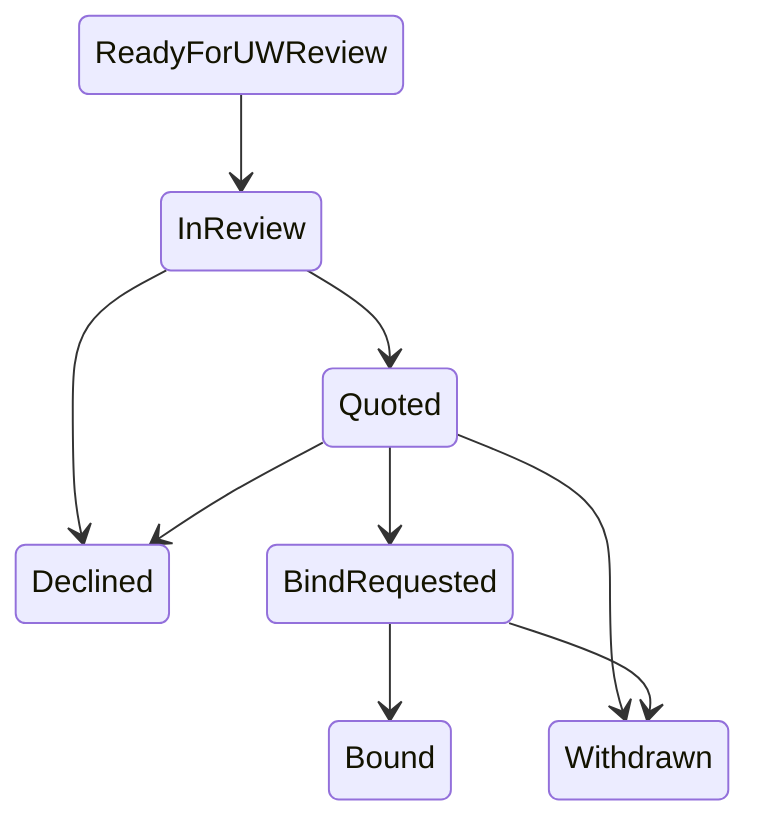
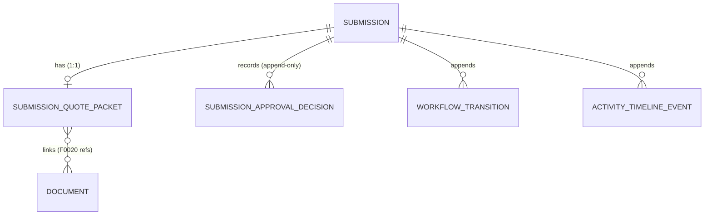

# F0019 — Submission Quoting, Proposal & Approval Workflow

**Status:** Planning complete — architecture approved (ADR-025 Accepted; G5, 2026-06-01); ready to build (feature action)
**Priority:** Critical
**Phase:** CRM Release MVP

## Overview

Complete the commercial P&C submission lifecycle beyond intake by adding quote preparation, the
submission-bound quote/proposal packet, a single-approver underwriting approval checkpoint, bind
readiness/decision, and the `Declined`/`Withdrawn` terminal states.
F0019 also owns the submission end-of-life contract that replaces F0006's descoped soft-delete claim,
using audit-preserving archive/deactivate behavior rather than implicit CRUD delete.

**CRM workflow, not underwriting workbench:** F0019 records status and reference facts and moves
submissions through approval and bind. It performs **no** rating, pricing, or scoring — quote figures
are recorded values, never computed (see PRD boundary guardrail).

Boundary guardrail: F0019 does not merely document downstream submission states; it is the feature that
explicitly turns them on (S0001). F0006 remains the authoritative intake boundary through
`ReadyForUWReview`, and the shared submission transition surface must continue rejecting
`ReadyForUWReview -> InReview` and later transitions until F0019 stories ship.

## Documents

| Document | Purpose |
|----------|---------|
| [PRD.md](./PRD.md) | Product scope, boundaries, packet contract, screen layouts, story breakdown |
| [STATUS.md](./STATUS.md) | Planning and implementation tracker (story checklist, signoff roles) |
| [GETTING-STARTED.md](./GETTING-STARTED.md) | Setup and refinement notes |

## Stories

| ID | Title | Status |
|----|-------|--------|
| [F0019-S0001](./F0019-S0001-activate-downstream-submission-workflow.md) | Activate downstream submission workflow | Planned |
| [F0019-S0002](./F0019-S0002-submission-quote-proposal-packet-lifecycle.md) | Submission quote/proposal packet lifecycle | Planned |
| [F0019-S0003](./F0019-S0003-underwriting-approval-checkpoint.md) | Underwriting approval checkpoint | Planned |
| [F0019-S0004](./F0019-S0004-bind-decision-and-policy-handoff.md) | Bind decision and policy handoff | Planned |
| [F0019-S0005](./F0019-S0005-decline-and-withdraw-terminal-decisions.md) | Decline and withdraw terminal decisions | Planned |
| [F0019-S0006](./F0019-S0006-submission-archive-and-deactivate.md) | Submission archive and deactivate | Planned |
| [F0019-S0007](./F0019-S0007-downstream-submission-pipeline-list-and-workflow-visibility.md) | Downstream submission pipeline list & workflow visibility | Planned |
| [F0019-S0008](./F0019-S0008-downstream-submission-workflow-timeline-and-audit-trail.md) | Downstream submission workflow timeline & audit trail | Planned |

**Total Stories:** 8
**Completed:** 0 / 8

## Architecture (Phase B)

Governing decision: **[ADR-025](../../architecture/decisions/ADR-025-submission-downstream-workflow-quote-approval-bind-and-archive.md)** (applies ADR-011 workflow + ADR-012 documents).

### Downstream state machine (activated by F0019)



Guards: `InReview→Quoted` needs a ready packet; `Quoted→BindRequested` needs a **granted approval**;
`Bound`/`Declined`/`Withdrawn` are terminal. Terminal submissions may be **archived** (`isArchived`,
reversible) — they leave active queues but stay discoverable for audit.

### Entity relationships (ERD)



```
Submission ─1:1─ SubmissionQuotePacket ──links──> Document (F0020 / ADR-012)
   │                  └─ recorded facts (premium/limits/dates) — NEVER computed
   ├─1:N─ SubmissionApprovalDecision (append-only; single approver)
   ├─1:N─ WorkflowTransition (append-only, ADR-011)
   ├─1:N─ ActivityTimelineEvent (append-only)
   └─ on Bound ··> policy-creation handoff/correlation ··> Policy (F0018)
```

### Component view (C4-ish, all within `engine/`)

```
SubmissionWorkflowService  → transitions + guards (reuses WorkflowTransition + timeline; Casbin submission:transition)
QuotePacketService         → packet status + recorded facts + F0020 doc links (no rating/compute)
ApprovalService            → SubmissionApprovalDecision (Casbin submission:approve)
BindService                → bind (idempotent) + F0018 policy-creation handoff
ArchiveService             → isArchived lifecycle (Casbin submission:archive; IgnoreQueryFilters discoverability)
```

New shared semantics: `entity:submission-quote-packet`, `entity:submission-approval-decision`,
`capability:submission-workflow` (carries the CRM-not-workbench boundary), `policy_rule:submission-approve`,
`policy_rule:submission-archive`. Endpoint/event canonical nodes are finalized at implementation.
