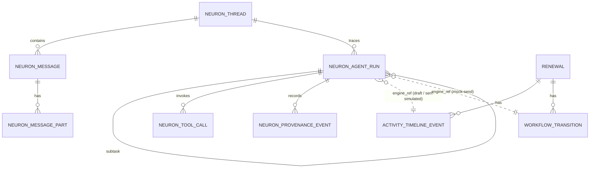

# F0038 — Neuron Day-at-a-Glance Shell

**Status:** Planned — Phase A approved (plan run `2026-06-30-dbc93ab5`); Phase B architecture approved (plan run `2026-06-30-d1dd91f7`, G5 operator approval 2026-06-30)
**Priority:** High
**Phase:** Neuron Companion (epic first slice — Now)

## Overview

First slice of the Neuron Companion epic: a conversational companion embedded in the CRM that renders a multi-zone **Day-at-a-Glance** shell. The **Renewals zone is live** (surfaces renewals needing attention and offers a one-click, ready-to-edit broker outreach draft + mock-send); the other zones ship as inert "not yet active" stubs. Assembly, not composition — the cross-zone "brain" is deferred. Proves the full companion chain end-to-end and lays the multi-head pathway.

## Planning Guardrails

- F0038 is the first runnable Neuron implementation and must bootstrap the
  stateless Neuron runtime, A2A-aligned internal delegation, simple versioned
  YAML orchestration, specialist-head registry, tool registry, prompt
  provenance, and message/component contract.
- Neuron calls the engine as the user with the forwarded authentik token; the
  engine remains the authorization and source-of-truth boundary.
- Durable Neuron operation state is **Neuron-owned**: the Python service owns its
  own `neuron` Postgres schema + migrations and writes them directly (no engine
  pass-through). Neuron must not become a store for CRM/product data — CRM business
  writes go through the engine as the user.
- The frontend renders registered components from the message envelope. Neuron
  returns component identifiers, props, and actions; it never returns executable
  markup.
- F0038 uses in-CRM component architecture for MCP/tool-style apps. MCP-UI,
  sandboxed resources, and external hosts are deferred.

Architecture source: [ADR-027](../../architecture/decisions/ADR-027-neuron-companion-a2a-orchestration.md)
and [Neuron Companion C4 ASCII sketches](../../architecture/c4-neuron-companion.md).

## Architecture (Phase B)

Authored at plan run `2026-06-30-d1dd91f7`. C4 L2 (container) + L3 (component)
views live in [`c4-neuron-companion.md`](../../architecture/c4-neuron-companion.md)
and the ADR-027 ASCII sketch.

| Concern | Artifact |
|---------|----------|
| Orchestration foundation (A2A-aligned, YAML plans, Agent Cards) | [ADR-027](../../architecture/decisions/ADR-027-neuron-companion-a2a-orchestration.md) |
| Persistence schema, cross-store consistency, outreach authorization | [ADR-028](../../architecture/decisions/ADR-028-neuron-companion-persistence-and-outreach-authorization.md) |
| `neuron.*` operation store + ERD | [data-model.md §11](../../architecture/data-model.md#11-neuron-companion-operation-store-neuron-schema--f0038-adr-027-adr-028) |
| Neuron service API | [`api/neuron-api.yaml`](../../api/neuron-api.yaml) |
| Engine companion endpoints (`NeuronCompanion` tag) | [`api/nebula-api.yaml`](../../api/nebula-api.yaml) |
| Message envelope / zone payload / Agent Card / YAML plan schemas | `schemas/neuron-message-envelope`, `neuron-zone-payload`, `neuron-agent-card`, `neuron-orchestration-plan` |
| Engine contract schemas | `schemas/renewal-needs-attention-item`, `renewal-outreach-draft-request`, `renewal-outreach-mock-send-request`, `neuron-companion-telemetry-event` |
| `renewal:draft_outreach` authorization | [authorization-matrix §2.9a](../../security/authorization-matrix.md), `security/policies/policy.csv` |

### Feature ERD — `neuron.*` operation store (Mermaid)

F0038 introduces the Neuron-owned operation entities below. CRM business entities
(Renewal, ActivityTimelineEvent, WorkflowTransition, Account, Broker) are
engine-owned and unchanged; the dashed edges are cross-store **references**
(`engine_ref_id`), not foreign keys (ADR-028 §2).



### Feature ERD (ASCII)

```text
   neuron.* (Neuron-owned, written direct)         engine app schema (source of truth)
   ┌───────────────┐                               ┌──────────────────────────┐
   │ neuron_thread │1───*┌──────────────┐          │ Renewal                  │
   └──────┬────────┘     │ neuron_message│          └───────┬──────────┬───────┘
          │1             └──────┬────────┘                 1│         1│
          │              *      │1                          *│         *│
          *              ┌──────┴───────────┐    ┌───────────┴───┐ ┌────┴────────────┐
   ┌──────┴────────┐     │ neuron_message_  │    │ ActivityTimelineEvent│ │WorkflowTransition│
   │ neuron_agent_ │     │ part             │    └───────▲───────┘ └────▲────────────┘
   │ run           │     └──────────────────┘            ┊ engine_ref   ┊ engine_ref
   └──┬────────┬───┘                                     ┊ (draft /     ┊ (mock-send:
      │1       │1   └┄┄┄┄┄┄┄┄┄┄┄┄┄┄┄┄┄┄┄┄┄┄┄┄┄┄┄┄┄┄┄┄┄┄┄┄┘ sent-sim)    ┊  Identified→Outreach)
      *        *                                                        ┊
 ┌────┴────┐ ┌─┴──────────────┐   neuron_agent_run.engine_ref_id ┄┄┄┄┄┄┄┘
 │tool_call│ │provenance_event│
 └─────────┘ └────────────────┘
   (engine write commits first & authoritative; neuron record references its id, idempotent)
```

## Documents

| Document | Purpose |
|----------|---------|
| [PRD.md](./PRD.md) | Product scope and business outcomes (skeleton) |
| [intake-brief.md](./intake-brief.md) | Signed-off Pre-Phase-A stakeholder intake brief (epic source) |
| [STATUS.md](./STATUS.md) | Planning and implementation tracker |
| [GETTING-STARTED.md](./GETTING-STARTED.md) | Setup and refinement notes |

## Stories

| ID | Title | Status |
|----|-------|--------|
| [F0038-S0001](./F0038-S0001-neuron-service-bootstrap.md) | Neuron service bootstrap (runtime + registries + versioned orchestration) | Not Started |
| [F0038-S0002](./F0038-S0002-day-at-a-glance-shell-and-zone-dispatch.md) | Day-at-a-Glance shell + zone-dispatch + message/component envelope | Not Started |
| [F0038-S0003](./F0038-S0003-live-renewals-zone-read.md) | Live Renewals zone (needs-attention list + drill context) | Not Started |
| [F0038-S0004](./F0038-S0004-stub-zones-inactive-payload.md) | Stub zones — inert "not yet active" payload | Not Started |
| [F0038-S0005](./F0038-S0005-renewal-outreach-draft.md) | Renewal outreach draft (generate-on-click, persist, edit in-chat) | Not Started |
| [F0038-S0006](./F0038-S0006-mock-send-and-workflow-transition.md) | Mock-send (commit `Identified → Outreach`, fake SMTP) | Not Started |
| [F0038-S0007](./F0038-S0007-crm-scope-guard.md) | CRM-scope guard (out-of-scope → polite redirect) | Not Started |
| [F0038-S0008](./F0038-S0008-companion-telemetry-instrumentation.md) | Companion telemetry (baseline timestamps + minimal secondary metrics) | Not Started |

**Total Stories:** 8 (authored during the `plan` run, Phase A)
**Completed:** 0 / 8

## Epic Context

- **F0038 (Now)** — this feature: Day-at-a-Glance shell, Renewals live, draft outreach + mock-send.
- **F0039 (Next)** — Multi-thread conversations (persistence impl + thread UX).
- **F0040 (Next)** — Second specialist head (flip a stub zone to live; head contract hardens).
- **Later** — Day-at-a-Glance brain (cross-zone composition), real outbound send + Comms Hub (F0021), MCP-UI external hosts, richer writes.
