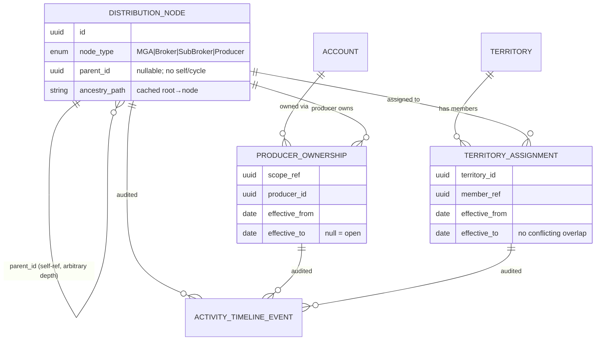

# F0017 — Broker/MGA Hierarchy, Producer Ownership & Territory Management

**Status:** Done
**Archived:** 2026-07-03
**Priority:** High
**Phase:** CRM Release MVP+

## Overview

Model broker, MGA, producer, and territory structure so ownership, reporting, and distribution workflows can reflect how commercial P&C channels actually operate.

## Documents

| Document | Purpose |
|----------|---------|
| [PRD.md](./PRD.md) | Product scope and business outcomes |
| [STATUS.md](./STATUS.md) | Planning and implementation tracker |
| [GETTING-STARTED.md](./GETTING-STARTED.md) | Setup and implementation handoff notes |

## Stories

| ID | Title | Status |
|----|-------|--------|
| [F0017-S0001](./F0017-S0001-model-broker-mga-hierarchy.md) | Model broker/MGA hierarchy (self-referencing, arbitrary depth) | Done |
| [F0017-S0002](./F0017-S0002-navigate-hierarchy.md) | Navigate and traverse the distribution hierarchy | Done |
| [F0017-S0003](./F0017-S0003-producer-ownership-effective-dated.md) | Assign and maintain producer ownership (effective-dated) | Done |
| [F0017-S0004](./F0017-S0004-territory-management-effective-dated.md) | Define and manage territories with effective-dated assignment | Done |
| [F0017-S0005](./F0017-S0005-hierarchy-ownership-territory-audit.md) | Audit and timeline for hierarchy, ownership, and territory changes | Done |

**Total Stories:** 5
**Completed:** 5 / 5

## Architecture

Governed by [ADR-026](../../architecture/decisions/ADR-026-broker-mga-hierarchy-producer-ownership-and-territory.md);
entities detailed in [data-model.md §9](../../architecture/data-model.md). MVP =
arbitrary-depth self-referencing hierarchy + effective-dated producer ownership +
effective-dated territory + change audit. Enforcement + rollups deferred to F0037.

### Feature ERD (Mermaid)



### ASCII companion

```
              ┌────────────────────────┐
              │   DISTRIBUTION_NODE     │  parent_id self-ref (arbitrary depth,
              │  MGA▸Broker▸Sub▸Producer│  no cycle/self/orphan; cached ancestry)
              └───────┬───────┬─────────┘
        producer owns │       │ assigned to
          ┌───────────▼──┐ ┌──▼───────────────┐
ACCOUNT──▶│PRODUCER_OWNER│ │TERRITORY_ASSIGNMT│◀──TERRITORY
 scope    │ effective-   │ │ effective-dated, │   (unique active name)
          │ dated (1 open│ │ no conflicting   │
          │ per scope)   │ │ overlap)         │
          └──────┬───────┘ └──────┬───────────┘
                 └──── audit ──────┴───▶ ACTIVITY_TIMELINE_EVENT (immutable)
```
