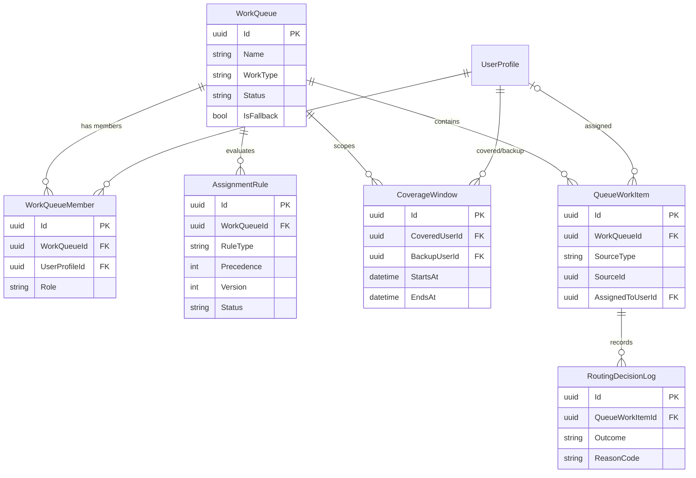
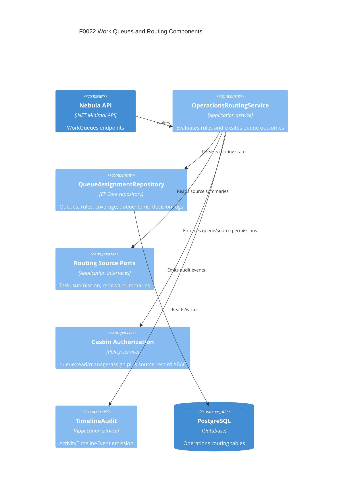

# F0022 — Work Queues, Assignment Rules & Coverage Management

**Status:** Done
**Archived:** 2026-07-03
**Priority:** High
**Phase:** CRM Release MVP

## Overview

Add queue-based work distribution, routing rules, reassignment, workload balancing, and backup coverage so Nebula supports operational team management beyond personal task lists.

## Documents

| Document | Purpose |
|----------|---------|
| [PRD.md](./PRD.md) | Product scope and business outcomes |
| [STATUS.md](./STATUS.md) | Planning and implementation tracker |
| [GETTING-STARTED.md](./GETTING-STARTED.md) | Setup and refinement notes |
| [ADR-013](../../architecture/decisions/ADR-013-operational-routing-and-queue-engine.md) | Accepted routing engine architecture |
| [data-model.md](../../architecture/data-model.md#18-work-queues-assignment-rules-and-coverage-f0022) | F0022 queue/rule/coverage data model |
| [nebula-api.yaml](../../api/nebula-api.yaml) | F0022 WorkQueues API contract |

## Stories

| ID | Title | Status |
|----|-------|--------|
| [F0022-S0001](./F0022-S0001-manage-work-queues-and-memberships.md) | Manage work queues and memberships | Done |
| [F0022-S0002](./F0022-S0002-define-assignment-rules-and-precedence.md) | Define assignment rules and precedence | Done |
| [F0022-S0003](./F0022-S0003-route-work-from-tasks-submissions-and-renewals.md) | Route work from tasks, submissions, and renewals | Done |
| [F0022-S0004](./F0022-S0004-manage-backup-coverage-windows.md) | Manage backup coverage windows | Done |
| [F0022-S0005](./F0022-S0005-queue-worklists-and-aging-visibility.md) | Queue worklists and aging visibility | Done |
| [F0022-S0006](./F0022-S0006-reassign-and-rebalance-queued-work.md) | Reassign and rebalance queued work | Done |
| [F0022-S0007](./F0022-S0007-routing-audit-permissions-and-exceptions.md) | Routing audit, permissions, and exceptions | Done |

**Total Stories:** 7
**Completed:** 7 / 7

## Feature ERD



ASCII companion:

```text
WorkQueue
  |-- WorkQueueMember -> UserProfile
  |-- AssignmentRule
  |-- CoverageWindow -> covered/backup UserProfile
  `-- QueueWorkItem -> Task | Submission | Renewal
        `-- RoutingDecisionLog
```

## C4 Component View


