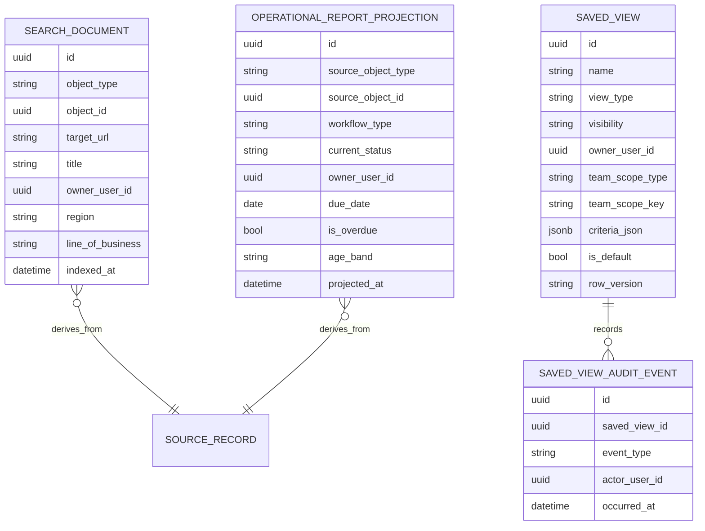
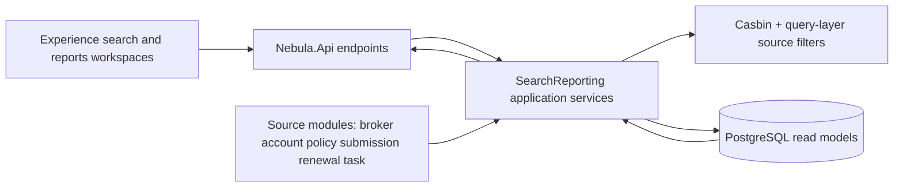

# F0023 - Global Search, Saved Views & Operational Reporting

**Status:** Planned — Phase A + B approved (plan run `2026-06-19-2f180001`); ready for feature action
**Priority:** High
**Phase:** CRM Release MVP

## Overview

Adds one internal CRM search surface, reusable saved views, and practical operational reports so users can find records and managers can run daily triage without spreadsheet-heavy reporting.

## Documents

| Document | Purpose |
|----------|---------|
| [PRD.md](./PRD.md) | Product scope, workflows, screens, and story list |
| [STATUS.md](./STATUS.md) | Planning and implementation tracker |
| [GETTING-STARTED.md](./GETTING-STARTED.md) | Setup and refinement notes |
| [feature-assembly-plan.md](./feature-assembly-plan.md) | Phase B implementation execution plan |
| [acceptance-criteria-checklist.md](./acceptance-criteria-checklist.md) | F0023 acceptance criteria review checklist |
| [persona-distribution-operations-manager.md](./persona-distribution-operations-manager.md) | Primary manager persona |
| [persona-relationship-manager.md](./persona-relationship-manager.md) | Primary relationship user persona |
| [persona-underwriter.md](./persona-underwriter.md) | Secondary underwriting persona |

## Stories

| ID | Title | Status |
|----|-------|--------|
| [F0023-S0001](./F0023-S0001-global-search-results.md) | Global search returns grouped CRM results | Planned |
| [F0023-S0002](./F0023-S0002-filter-and-open-search-results.md) | Filter, sort, and open search results | Planned |
| [F0023-S0003](./F0023-S0003-personal-saved-views.md) | Personal saved views | Planned |
| [F0023-S0004](./F0023-S0004-team-saved-views.md) | Team saved views and defaults | Planned |
| [F0023-S0005](./F0023-S0005-daily-operational-workload-report.md) | Daily operational workload report | Planned |
| [F0023-S0006](./F0023-S0006-workflow-aging-and-backlog-report.md) | Workflow aging and backlog drilldowns | Planned |
| [F0023-S0007](./F0023-S0007-permission-safe-search-and-reporting.md) | Permission-safe search and reporting behavior | Planned |

**Total Stories:** 7
**Completed:** 0 / 7

## Architecture Review

**Phase B status:** Approved (plan run `2026-06-19-2f180001`)
**Execution Plan:** [`feature-assembly-plan.md`](./feature-assembly-plan.md)

### Key Findings

- F0023 introduces a SearchReporting read-side module with `SearchDocument`, `SavedView`, `SavedViewAuditEvent`, and `OperationalReportProjection`.
- Search/reporting uses PostgreSQL full-text search and projections for MVP; no external search engine is introduced.
- Saved views store criteria only and always rerun source authorization on apply.
- Hierarchy/territory-aware facets can consume F0017 data when available; hierarchy-aware access enforcement and distribution rollups remain deferred to F0037.

### Architecture Artifacts

| Artifact | Status |
|----------|--------|
| Data model / ERD | Drafted in `planning-mds/architecture/data-model.md` §10 |
| API contract (OpenAPI) | Drafted in `planning-mds/api/nebula-api.yaml` |
| Workflow state machine | N/A - F0023 reports on existing workflow states |
| Casbin policy | Drafted in `planning-mds/security/authorization-matrix.md` and `planning-mds/security/policies/policy.csv` |
| JSON schemas | Drafted in `planning-mds/schemas/*search*.json`, `saved-view*.json`, and `*report*.json` |
| C4 diagrams | Included below |
| ADRs | ADR-014 accepted for F0023 |
| Assembly plan | Approved |

### Feature ERD

### C4 Component View

