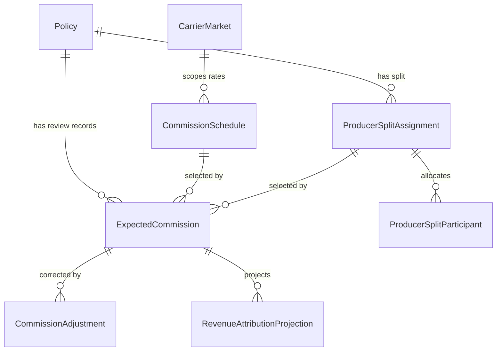
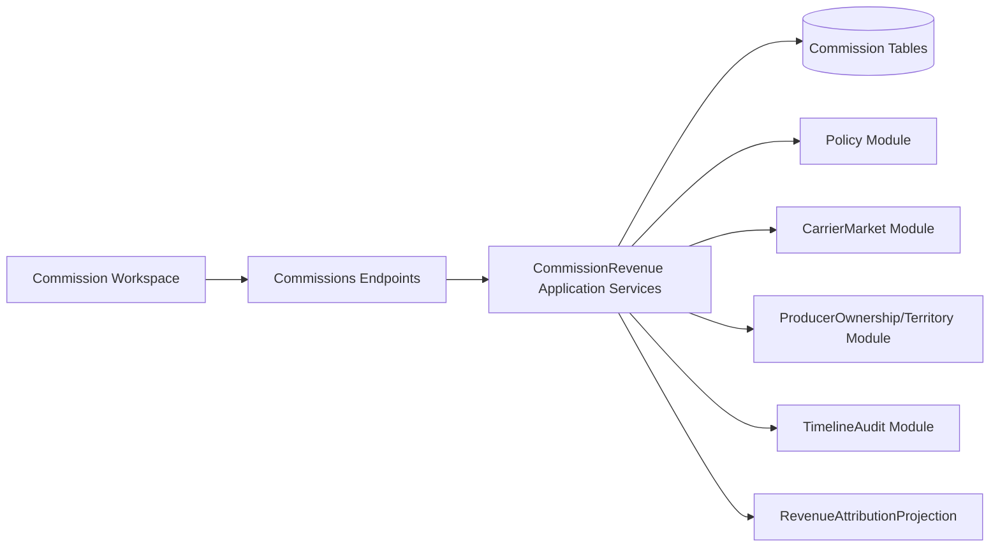

# F0025 — Commission, Producer Splits & Revenue Tracking

**Status:** Done and archived
**Archived:** 2026-07-07
**Priority:** Medium
**Phase:** Brokerage Platform Expansion

## Overview

Track expected commission, producer splits, and revenue attribution so Nebula can support brokerage economics and performance accountability beyond pure CRM workflows while staying out of full accounting, billing, payments, and reconciliation.

## Documents

| Document | Purpose |
|----------|---------|
| [PRD.md](./PRD.md) | Product scope, workflows, screen layouts, and story map |
| [STATUS.md](./STATUS.md) | Planning and implementation tracker |
| [GETTING-STARTED.md](./GETTING-STARTED.md) | Setup and refinement notes |

## Stories

| ID | Title | Status |
|----|-------|--------|
| [F0025-S0001](./F0025-S0001-commission-workspace-search-and-policy-context.md) | Commission workspace search and policy context | Done |
| [F0025-S0002](./F0025-S0002-commission-schedule-maintenance.md) | Commission schedule maintenance | Done |
| [F0025-S0003](./F0025-S0003-producer-split-assignment.md) | Producer split assignment | Done |
| [F0025-S0004](./F0025-S0004-expected-commission-calculation-review.md) | Expected commission calculation review | Done |
| [F0025-S0005](./F0025-S0005-commission-adjustment-and-approval.md) | Commission adjustment and approval | Done |
| [F0025-S0006](./F0025-S0006-revenue-attribution-rollups.md) | Revenue attribution rollups | Done |

**Total Stories:** 6
**Completed:** 6 / 6

## Phase A Notes

- Promoted to Now by operator decision on 2026-07-07.
- Dependencies F0017, F0018, and F0028 are completed and archived.
- Scope is limited to commission visibility, producer splits, revenue attribution, adjustments, and rollup reporting.
- Full accounting, billing, payments, reconciliation, producer payouts, and external self-service stay out of F0025.

## Phase B Architecture

- ADR: [ADR-032](../../../architecture/decisions/ADR-033-commission-producer-splits-and-revenue-tracking.md)
- Data model: [data-model.md §13](../../../architecture/data-model.md)
- API contract: [nebula-api.yaml](../../../api/nebula-api.yaml) `Commissions` tag
- Authorization: [authorization-matrix.md §2.10b.1](../../../security/authorization-matrix.md)

### ERD

### C4 Component

